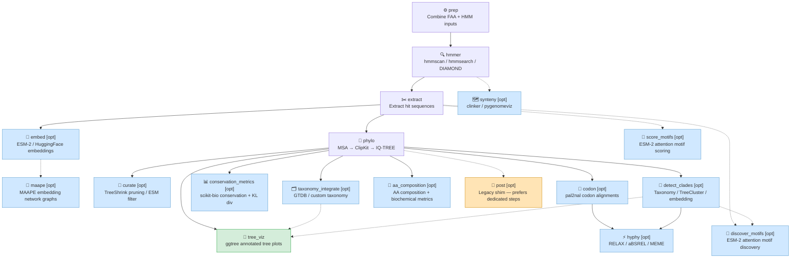
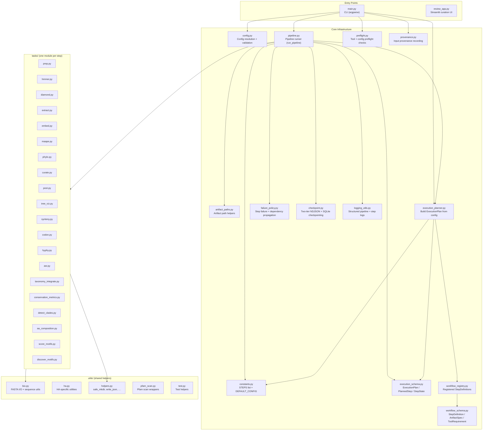
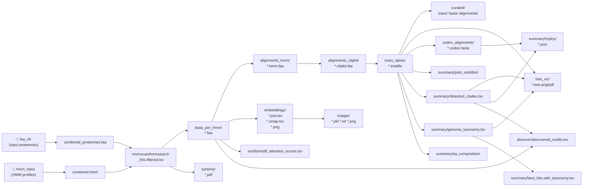

# PhyloFoundry — Codebase Graph

Generated from `/graphify .` on the `src/` tree.

---

## Pipeline Step Dependency Graph

Each node is a workflow step. Solid arrows (`-->`) represent hard dependencies;
dashed arrows (`-.->`) represent optional steps that depend on an upstream step.
Steps marked `[opt]` are skipped unless their `enabled` config flag is `true`.

---

## Source Module Structure

---

## Artifact Flow (Data Lineage)

